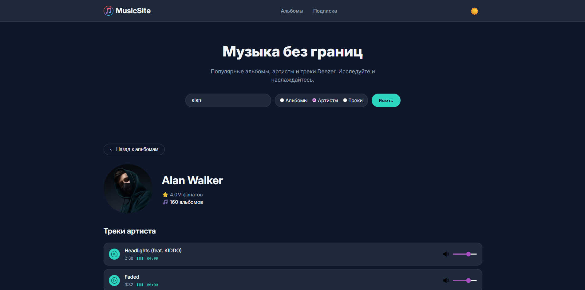
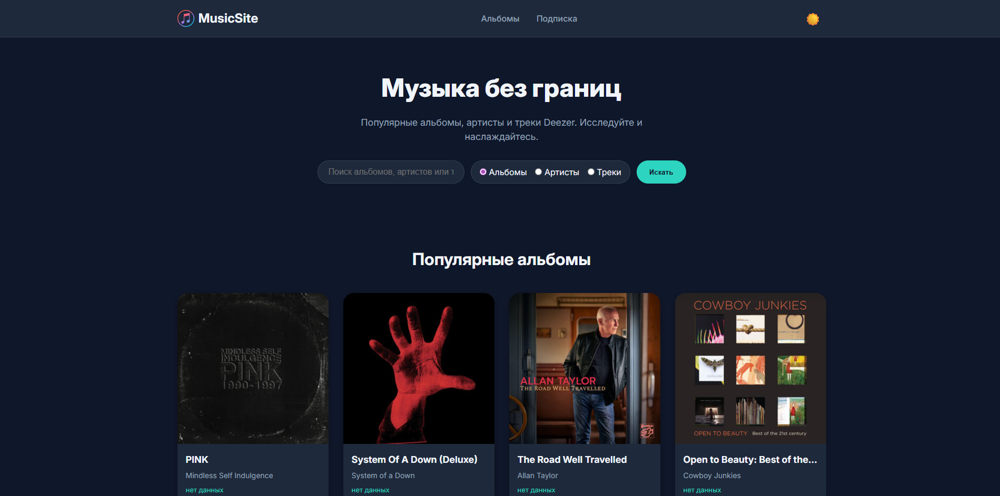
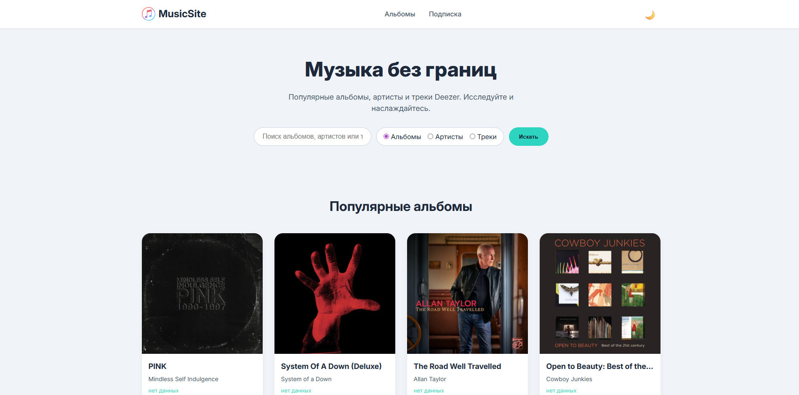

# MusicSite – Deezer гид

Современный музыкальный сайт для поиска альбомов, артистов и треков, прослушивания превью, управления громкостью и переключения тем.

## Цель проекта

Создать удобный и интерактивный веб-сайт, где пользователи могут:

- Просматривать популярные альбомы Deezer.
- Искать альбомы, артистов и треки через единую поисковую строку.
- Получать детальную информацию об артисте (фото, количество фанатов, список треков).
- Прослушивать 30-секундные превью треков с возможностью паузы, регулировки громкости и визуальным эквалайзером.
- Загружать дополнительные результаты (пагинация: кнопка «Загрузить ещё»).
- Переключать светлую/тёмную тему с сохранением выбора в `localStorage`.

## Используемые технологии

- **Frontend**: HTML5, CSS3 (Flexbox/Grid), JavaScript (ES6+)
- **API**: [Deezer Public API](https://developers.deezer.com/api) – без ключа, через прокси CORS
- **Хостинг**: GitHub Pages

## Основной функционал

- **Главная страница** – отображение популярных альбомов, поисковая панель с выбором типа (альбомы, артисты, треки).
- **Сетка карточек** – карточки альбомов/артистов/треков. По клику на альбом открывается страница артиста, на артиста – его треки.
- **Пагинация** – кнопка «Загрузить ещё» подгружает следующую порцию результатов (12 → 6 и т.д.).
- **Детали артиста** – аватар, имя, количество фанатов, список треков с кнопками воспроизведения, эквалайзером, таймером и ползунком громкости.
- **Плеер** – воспроизведение 30-секундного превью. Управление: play/pause, регулировка громкости, анимированный эквалайзер.
- **Поиск** – поиск альбомов, артистов или треков с мгновенным обновлением карточек.
- **Тёмная тема** – переключение между светлой и тёмной темой с сохранением выбора в `localStorage`.
- **Адаптив** – мобильная версия с бургер-меню и респонсив-сеткой карточек.

## Скриншоты

*Примеры интерфейса:*

## Посетите работающий веб-сайт

[https://ваш-username.github.io/musicsite](https://coffeecat45.github.io/MusicSite/)
